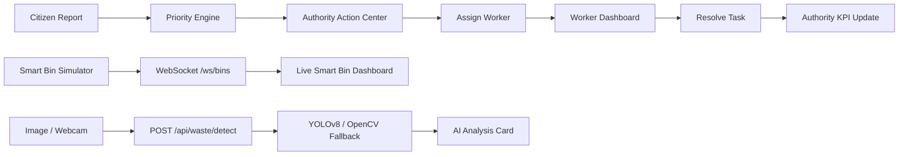

# GreenSync 🌿

## AI-Powered Smart Waste & Sanitation Management Platform

GreenSync is a hackathon-ready smart-city prototype that connects **citizen reporting, sanitation prioritization, worker task management, AI waste detection, and real-time smart-bin monitoring** in one workflow.

### Core flow

> **Detect → Report → Prioritize → Assign → Act → Resolve → Monitor**

---

## 🚀 What GreenSync Demonstrates

| Module | Live capability |
|---|---|
| 👥 Citizen Portal | Submit a sanitation issue with location and operational details |
| 🧮 Priority Engine | Calculates a 0–100 sanitation priority score through FastAPI |
| 🏛️ Authority Command Center | Monitors active issues, bin status, priority alerts and KPIs |
| 🚛 Worker Dashboard | Assign, start and resolve sanitation tasks |
| 🗑️ Smart Bin Monitoring | Receives changing fill levels through WebSockets |
| 📷 AI Waste Detection | Upload an image or use a live webcam for waste analysis |
| 📊 Analytics | Displays waste and sanitation trend visualizations |
| 🧠 GreenSync Intelligence | Presents prototype operational recommendations |

---

## 🔄 End-to-End Workflow



---

## 🏗️ System Architecture

```text
┌──────────────────────────────────────────────────────────────┐
│                     GreenSync Frontend                      │
│                 React + Vite + Tailwind                     │
│                                                              │
│ Citizen │ Authority │ Worker │ Smart Bins │ AI Waste       │
└──────────────────────────────┬───────────────────────────────┘
                               │
                    REST APIs + WebSockets
                               │
┌──────────────────────────────▼───────────────────────────────┐
│                       FastAPI Backend                        │
│                                                              │
│ Waste Detection │ Priority Engine │ Reports │ Tasks          │
│ Bin Telemetry   │ Event Broadcasting │ Health               │
└─────────────────────────────┬────────────────────────────────┘
                              │
             ┌────────────────┴────────────────┐
             ▼                                 ▼
      YOLOv8 / OpenCV                  Smart Bin Simulator
                                              │
                                              ▼
                                     Optional IoT Bridge
```

### Real-time channels

- `WS /ws/events` — broadcasts sanitation-report and task-status events.
- `WS /ws/bins` — broadcasts smart-bin telemetry updates.

The frontend can therefore update without a manual browser refresh.

---

## 🤖 AI Waste Detection

The AI Waste module supports:

- **Image upload**
- **Live webcam capture**

The frontend sends image data to:

```text
POST /api/waste/detect
```

The backend returns structured fields for the UI:

```json
{
  "detected_object": "Plastic Water Bottle",
  "category": "Recyclable",
  "confidence": 0.94,
  "recommended_bin": "Dry Waste / Recycling Bin",
  "impact": "Can be recycled and diverted from general landfill."
}
```

The backend attempts YOLOv8 inference when model weights are available. When they are not available, an OpenCV-based fallback keeps the demo operational.

> **Prototype note:** a production deployment should use a waste-specific model trained and validated for the target waste categories.

---

## 🧮 GreenSync Priority Engine

GreenSync calculates sanitation priority using the project formula:

```text
Priority Score =
(Fill Level × 0.30)
+ (Severity Weight × 0.25)
+ (Location Weight × 0.20)
+ (Time Weight × 0.15)
+ (Report Frequency × 0.10)
```

The API returns a score from `0–100` and a status such as:

```text
Low / Medium / High / Critical
```

Endpoint:

```text
POST /api/priority/calculate
```

---

## 🗑️ Live Smart Bin Monitoring

GreenSync includes a sensor simulator so the real-time Smart Bin feature can be demonstrated **without Arduino or ESP32 hardware**.

```text
Smart Bin Simulator
        ↓
WS /ws/bins
        ↓
FastAPI
        ↓
React Smart Bin Dashboard
```

Typical demo states can move through:

```text
Normal → Attention → Critical
```

without refreshing the browser.

### Future hardware path

The repository also includes an optional `iot_sensor_bridge.py` for a future Arduino/ESP32 + ultrasonic-sensor setup. The current hackathon demo does not require the hardware bridge.

---

## 🏛️ Citizen → Authority → Worker Loop

```text
Citizen submits issue
        ↓
Priority score calculated
        ↓
Issue appears in Authority Action Center
        ↓
Authority assigns worker
        ↓
Worker starts task
        ↓
Worker marks task resolved
        ↓
Authority KPIs update
```

This is the main connected operational workflow to demonstrate during a hackathon presentation.

---

## 🔌 API Reference

| Method | Endpoint | Purpose |
|---|---|---|
| `GET` | `/api/health` | Backend health check |
| `POST` | `/api/demo/reset` | Reset demo data/state |
| `POST` | `/api/waste/detect` | Analyze an uploaded/webcam image |
| `POST` | `/api/priority/calculate` | Calculate sanitation priority |
| `POST` | `/api/sanitation/report` | Create a sanitation issue |
| `GET` | `/api/sanitation/issues` | Fetch sanitation issues |
| `PATCH` | `/api/tasks/{task_id}` | Update worker task status |
| `GET` | `/api/bins` | Fetch smart-bin state |
| `POST` | `/api/bins/{bin_id}/telemetry` | Inject/test bin telemetry |
| `WS` | `/ws/events` | Live issue/task events |
| `WS` | `/ws/bins` | Live smart-bin telemetry |

Interactive API documentation:

```text
http://localhost:8000/docs
```

---

## 🛠️ Technology Stack

### Frontend

- React 18
- TypeScript / TSX
- Vite
- Tailwind CSS
- Recharts
- Lucide React

### Backend

- Python
- FastAPI
- Uvicorn
- OpenCV
- NumPy
- Ultralytics / YOLOv8

### Real-time / IoT

- WebSockets
- Python smart-bin simulator
- Optional serial IoT bridge

---

## 📁 Project Structure

```text
GreenSync-FINAL-POLISHED/
│
├── backend/
│   ├── main.py
│   ├── requirements.txt
│   ├── start_backend.bat
│   ├── setup_and_run.ps1
│   └── download_yolo_model.py
│
├── frontend/
│   ├── src/
│   │   ├── App.tsx
│   │   ├── main.tsx
│   │   ├── index.css
│   │   └── vite-env.d.ts
│   ├── package.json
│   ├── index.html
│   └── vite.config.js
│
├── iot/
│   ├── simulate_bin.py
│   ├── start_simulator.bat
│   └── iot_sensor_bridge.py
│
├── README.md
├── DEMO_CHEATSHEET.md
├── RUN_GREENSYNC.ps1
└── VERIFY_GREENSYNC.ps1
```

---

## 🚀 Run GreenSync Locally on Windows

### Prerequisites

- Windows 10/11
- Python 3.10+
- Node.js LTS + npm
- Git

### Option A — One-command setup

From the project root:

```powershell
Set-ExecutionPolicy -Scope Process -ExecutionPolicy Bypass
.\RUN_GREENSYNC.ps1
```

### Option B — Manual setup

#### Backend

```powershell
cd backend
python -m venv venv
Set-ExecutionPolicy -Scope Process -ExecutionPolicy Bypass
.\venv\Scripts\Activate.ps1
python -m pip install -r requirements.txt
python -m uvicorn main:app --reload --host 0.0.0.0 --port 8000
```

Open:

```text
http://localhost:8000
http://localhost:8000/docs
```

#### Frontend

Open a second PowerShell window:

```powershell
cd frontend
npm install
npm run dev -- --host 127.0.0.1
```

Open the Vite URL shown in the terminal, normally:

```text
http://127.0.0.1:5173
```

#### Smart Bin simulator

Open a third PowerShell window:

```powershell
cd iot
..\backend\venv\Scripts\python.exe simulate_bin.py
```

The Smart Bin dashboard should update continuously without refreshing.

---

## 🎬 5-Minute Hackathon Demo Flow

### 1. Start

Show the GreenSync landing page and briefly explain the connected sanitation workflow.

### 2. Citizen Report

```text
Citizen → Report Issue → Submit
```

### 3. Automatic Prioritization

Show the calculated priority score.

### 4. Authority Command Center

Show the issue arriving without a browser refresh.

### 5. Worker Resolution

```text
Assign → Start Task → Resolve
```

Then show the Authority KPI update.

### 6. Live Smart Bin

Run the simulator and show the fill percentage changing in real time.

### 7. AI Waste

Demonstrate image upload and live webcam input.

### 8. Closing line

> **GreenSync connects detection, prioritization, and field action into one real-time sanitation workflow.**

---

## 📸 Screenshots

Add screenshots from your own final demo here. Recommended set:

```text
screenshots/
├── landing-page.png
├── authority-command-center.png
├── action-center.png
├── worker-dashboard.png
├── smart-bins-live.png
└── ai-waste-webcam.png
```

Then embed them with Markdown, for example:

```markdown

```

Use your own application screenshots so the repository reflects the exact version you are presenting.

---

## ⚠️ Prototype Scope

This repository is a local hackathon prototype. The current implementation intentionally uses:

- local development servers
- prototype/demo data in parts of Analytics and Intelligence
- a smart-bin simulator when physical hardware is unavailable
- an OpenCV fallback when a dedicated YOLO waste model is not available

For production deployment, the next engineering steps include persistent storage, authentication and authorization, secured secrets, production deployment, monitoring, a validated waste-specific model, and hardware testing.

---

## 🌱 Future Extensions

- Production database for sanitation history
- Role-based authentication
- GPS/map integration
- Waste-specific model training
- ESP32/Arduino hardware integration
- Route optimization for sanitation teams
- Notifications for high-priority events
- Cloud deployment and monitoring

---

## 🏆 Hackathon Context

GreenSync is developed as a Smart India Hackathon-oriented prototype focused on making waste and sanitation operations more connected, responsive, and data-driven.

---

## 👥 Team

```text
Team Name: ____________________

1. ____________________
2. ____________________
3. ____________________
4. ____________________
```

---

## 📄 License

Add the license required by your team, institution, or hackathon before publishing the repository as an open-source project.
